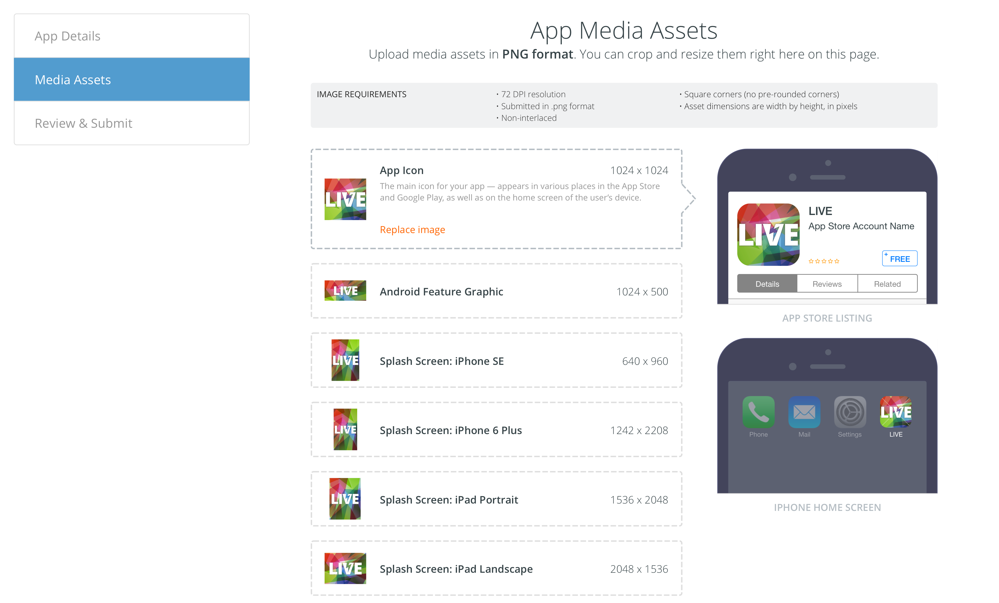
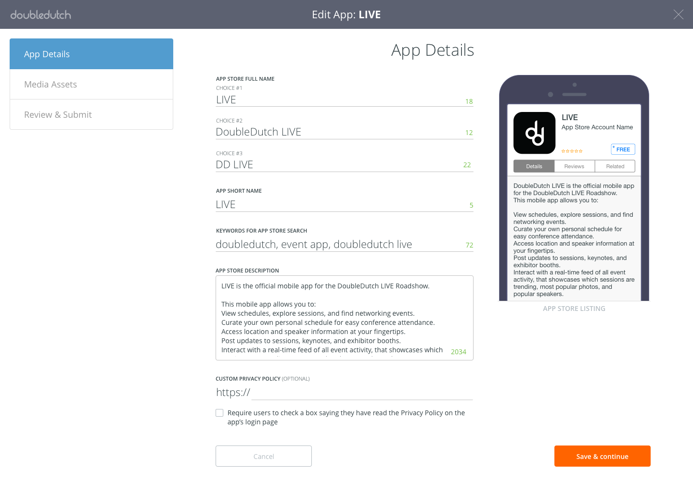
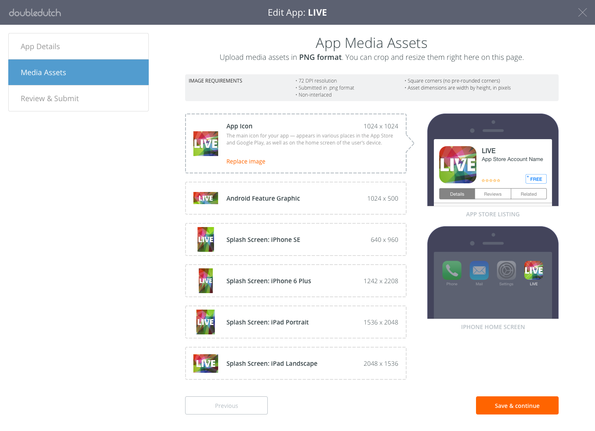
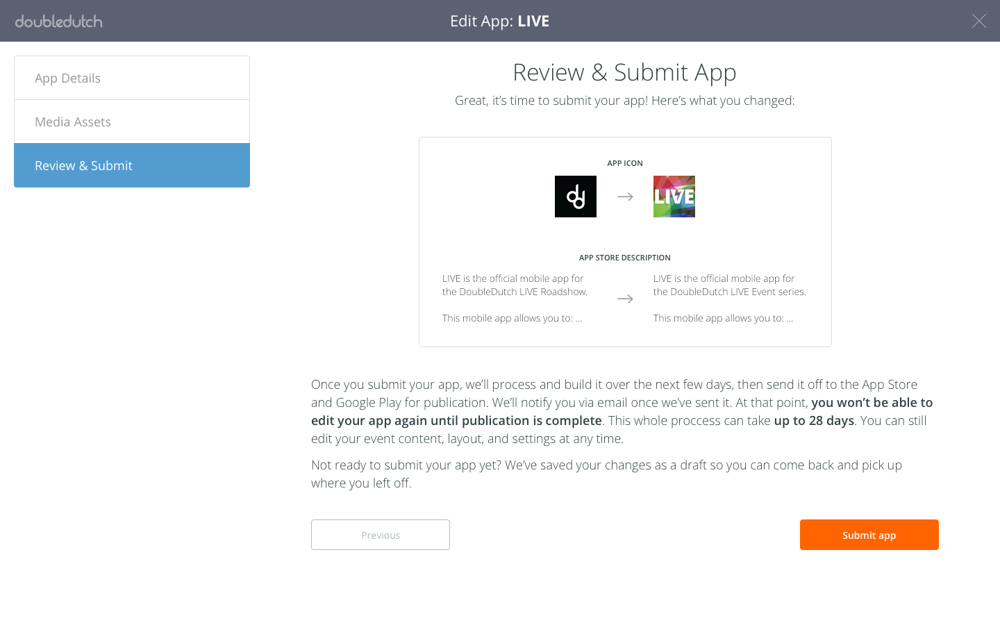

  

## Context

DoubleDutch customers create their own custom mobile event app, so their attendees can have a fully customized and branded experience when they attend an event. Any time an customer wants to change to an app-level detail, like an image assets or their app description, they have to resubmit their app for publication.

Once the app changes are submitted, the DoubleDutch ops team reviews the app, builds it, and sends it to the App Store and Google Play for review. Once it’s in the hands of the app stores, the publication process can take several weeks.

## The Objective

There was lot of confusion around the app submission process. The two main problems that I wanted to solve were:

*   __Event organizers had trouble understanding what all the various names, descriptions, and media assets were for.__
We had help pages explaining what every app-level field was &mdash; but confused customers would still contact us every time they wanted to update their app. There are so many form fields with particular requirements, and customers would often notice changes they need to make only after seeing it published in the App Store. For example, they might create a detailed image for their app icon before realizing how small it appears on attendees' phones. The cost of these mistakes is high, as the organizer then has to make changes, resubmit their app, and wait for the app stores to approve their newest revision, which can take weeks.
*   __Event organizers didn't realize that every app edit kicks off an approval and publication process, and that their changes can take up to a month to appear in app stores.__
They would make an edit, check on their app, and then contact us asking why their change isn't there. They would make changes very casually, often submitting multiple changes in a day. This caused problems for the DoubleDutch ops team who was reviewing app changes.

## Final Design

I added phone previews for each field that update live as the event organizer types their details. As they move through the different fields, the phone changes to show where this field will appear to attendees.

The event organizer can click through the different media assets and see where each will appear to the attendee.

Before this design, event organizers edited their app in a modal and clicked a "Save" button to submit it. This really didn't indicate the importance of this action and what it entails. I added a Review & Submit screen where the event organizer can see all their changes and get an explanation of what will happen when they submit their app.

