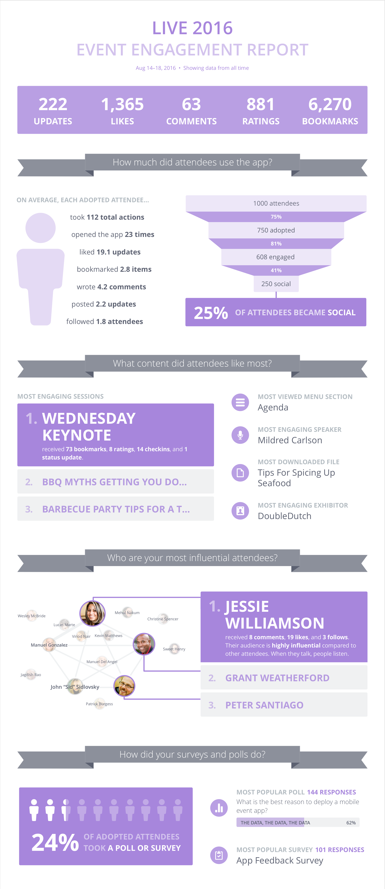

  <browser-chrome></browser-chrome>
  

    

    
  

## Discovery & Background

DoubleDutch has several reporting dashboards and exportable reports that show how attendees interacted with the event app. We’ve seen that many customers find these reports to be overwhelming and aren’t sure what to do with them.

Through past user research, we’ve identified a few different personas within a customer’s organization that describe how they interact with data:

The Leader cares about the ROI of their event; but typically the one who is in our CMS and is the Planner. The Planner cares about attendee experience and event logistics, and is not connected to the business goals of their company. They’re not data oriented, and don’t know what they’re looking for when a lot of choices are presented to them.

We wanted to provide a report that was targeted at the Planner, that they could easily share with other event stakeholders. A couple of years ago we had an infographic-style PDF report that was really resonated with some of our customers. We wanted something similar, but with the goal of increasing the sophistication of the data we’re presenting just a little bit.

My project manager and I talked to several customers: some who had used the old report, and some who had requested a shareable summary of their event. We also conducted some internal interviews with Customer Support and Account Managers within DoubleDutch. Here are some snippets from our notes:

## The Objective

We identified that customers wanted a report that was:

1.   __Simple and visually appealing__. Customers wanted something that tells the story of their event with a few key metrics, and looks nice.
2.   __Easily shareable via email or a slideshow presentation__. Customers either wanted to send out a report to their boss and colleagues via email, or present portions of the report in PowerPoint slides.

From a business perspective, we wanted the report to be __distributed to other stakeholders in the company__. We wanted this report to appeal to the Planner so they would share it; but ultimately we want to get the Event Owner and the Leader to see the value of our data. This meant making the report useful enough that more data-minded customers would see its value, but still simple and easy enough that it resonates with the Planner.

## The Final Product

I tried out a lot of different options, but ultimately landed on the report below. It’s infographic-y, modular, and mostly uses data that we already have APIs for. It uses the brand color of the event to display the data (purple in this example). This report is currently in beta, where it can be pulled automatically but needs to be sent to customers manually as a PDF. We’re gathering feedback and seeing how it looks with different types of event data, and plan to make it available to all customers soon.

  <browser-chrome></browser-chrome>
  

    

    
  

## Future Iteration

In the next version we want users to be able to easily share this report via our system.

  <browser-chrome></browser-chrome>
  

    

    
  

