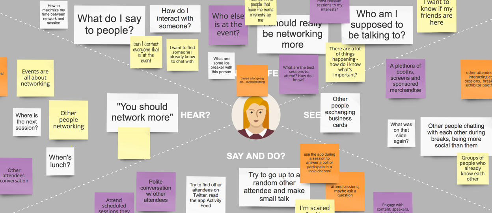
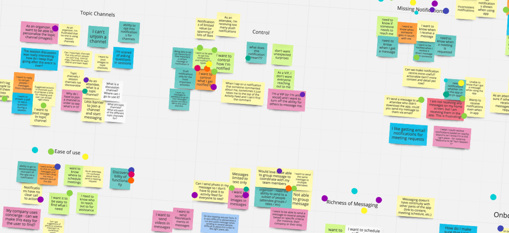
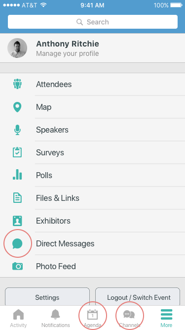
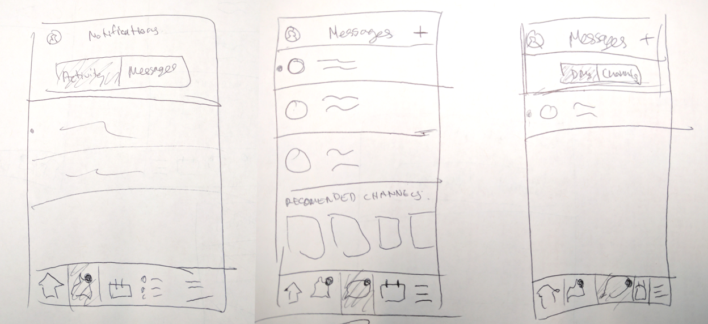
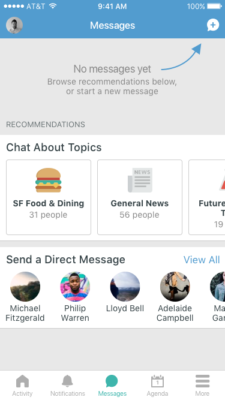
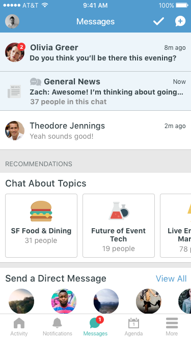
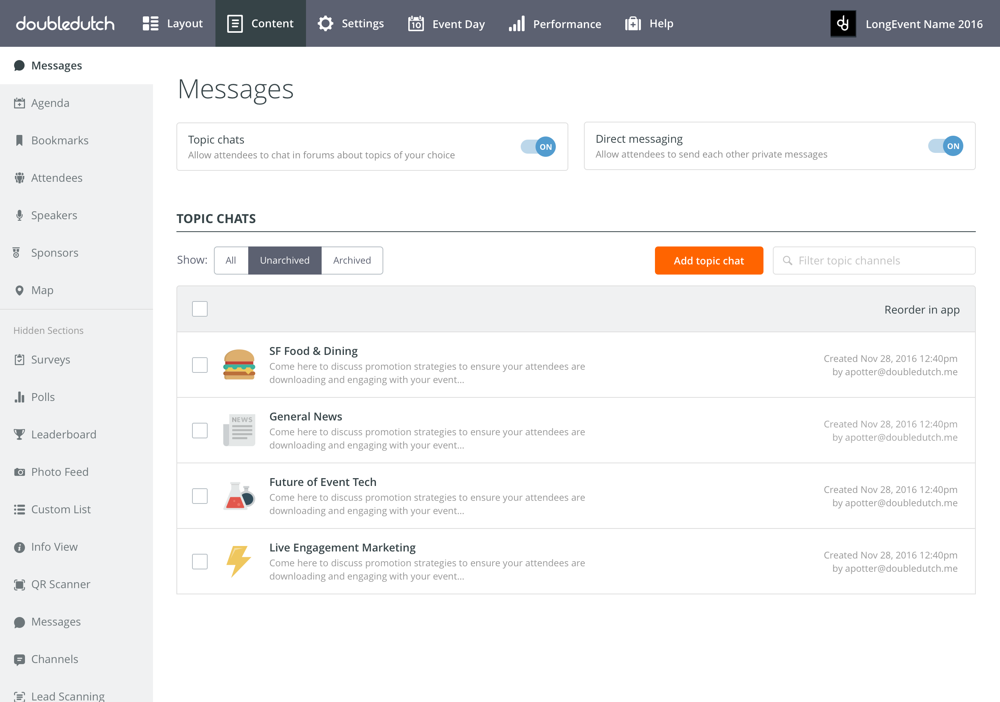
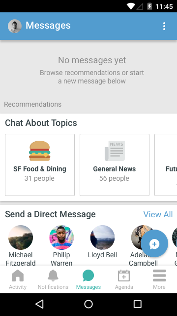
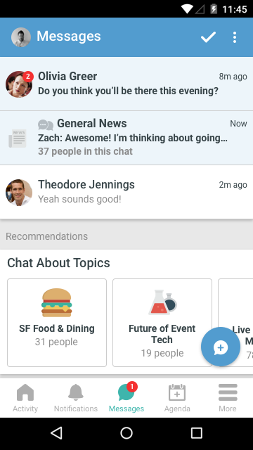
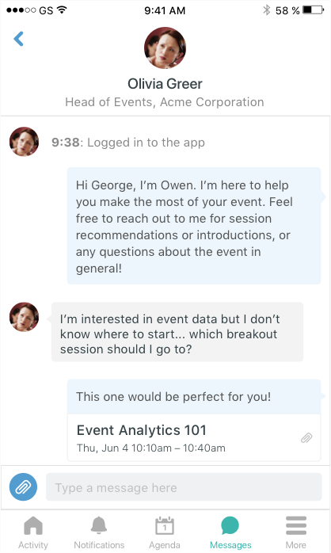

  

## Discovery & Background

We’ve heard feedback—from customers, attendees, and internal employees alike—that our messaging features aren't intuitive to use, and that attendees don’t always know when someone’s trying to get in touch with them. We knew there were several potential problems we could address, and we needed to scope them down to the most important ones.

My product manager and I kicked off the project with discovery and brainstorming sessions with internal stakeholders in different departments. We started by creating empathy maps for several different user types: Novice Attendee, Expert Attendee, Exhibitor, and Event Planner. Many of our team members are remote, so we used a tool called Realtime Board to capture everyone’s ideas. We left this exercise pretty open ended, as we wanted to get everything on the board before narrowing it down. Here’s a snippet from our Novice Attendee board:

Next we compiled the biggest problems related to networking, messaging, and notifications from all our different user types. We grouped them by themes and each set our top priorities by putting dots on the themes and individual problems we thought were most important.

Here you'll see references to a few different messaging features that live in different sections of the app: Direct Messages, Topic Channels, and Session Channels. (At the time theey were built, this made sense with the general schema we use that allows event organizers to show and hide app sections to toggle features on or off.) Topic Channels are group chatrooms based on topics that the event organizer sets up in advance, and that attendees can browse and join. Session Channels are a chatroom for every session, which you can find by going to the session in the Agenda section.

## The Objective

<grid>
  

    
The main issues we wanted to address were related to missing notifiations and ease of use. This was also confirmed by the low messaging usage we were seeing. The two biggest metrics we wanted to move were:

    <ol>
      <li>Attendee adoption & engagement. We have very a low percentage of attendees using messaging features, and we want to see this go up. We think there are a variety of reasons why attendees don't use messaging, including: attendees not knowing that the features exist to begin with; not noticing when they receive a message; and not understanding how they should use Topic Channels and Session Channels.</li>
      <li>Event organizer adoption. Many organizers did not enable these features for their events at all. They cited many reasons, but two big ones were: they didn’t know the features existed or how to use them; or they tried them at one event and didn’t see a lot of attendees using them, so it didn’t seem worth setting them up again.</li>
    </ol>
  

  
</grid>

## Weighing Navigation Options

When thinking about how to solve this problem, I looked at other social apps with messaging features as inspiration. They all handle messaging in one of two different ways: separate sections for messaging and notifications; or a single notifications tab with messaging and non-messaging notifications in subtabs. Within messaging, some apps had subtabs for different types of messaging. I did some rough sketches of what these options would look like for our app:

## The "Final" Designs

Before we started development, we had calls with customers to walk through designs and get their reactions. For the most part they were really positive, and could clearly understand what was going on in the workflows we showed them. One of things we learned was that the phrase “Topic Channels” is not very clear. Customers who had not used this feature before weren’t sure what they were for, so I adjusted the language a bit.

We decided not to make any changes to Session Channels, and instead to focus on Direct Messages and Topic Channels for V1. We felt that DMs and Topic Channels have the clearest use case and the most potential for engagement.

<grid>
  

    

      

      

      

      

        
      

      

    

  

  

    

      

      

      

      

        
      

      

    

  

  

    
This project is currently in development. Here are the mockups that are being implemented for our first iteration.

    <ul>
      <li>Direct messages are more important than topic chat messages, so unread DMs always appear on top. Push notifications will only be sent for direct messages, but the red dot will appear on the Messages section for everything.</li>
      <li>I wanted attendees to be able to start browsing as soon as they get to the Messages tab. Horiziontal scrolling carousels allow for more recommendations to be added later.</li>
    </ul>
  

</grid>

For event organizers, messaging features were also in different places in the CMS. I put them all in one section so they're easily discoverable, but can still be turned on and off individually. We're also planning start turning them on for all events by default—with a little tutorial letting organizers know about the changes we made.

  <browser-chrome></browser-chrome>
  

    

    
  

Slightly different UI on Android vs iOS:

<grid>
  

    

      

      

      

        
      

      

    

  

  

    

      

      

      

        
      

      

    

  

</grid>

## Future Iteration

<grid>
  
Ultimately we want to allow users to easily reference event content in their messages. This really adds to the value of using our messaging during the event rather than another app.

  

    

      

      

      

      

        
      

      

    

  

</grid>
