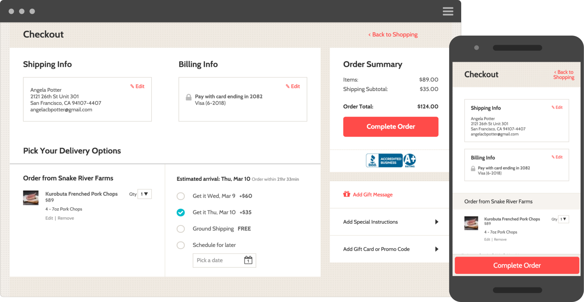
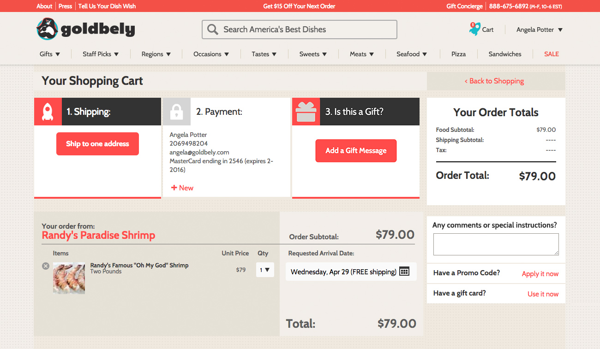
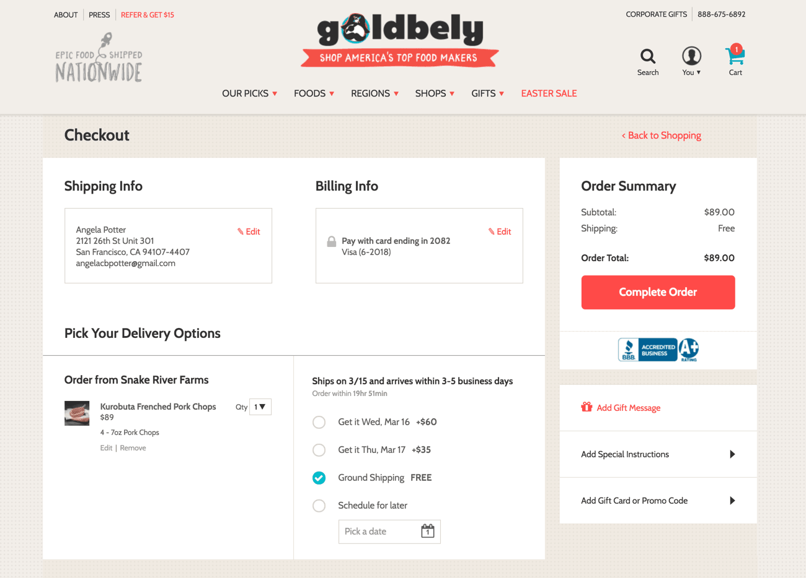

  

## The Objective

This is what the Goldbely checkout experience looked like when I started redesigning it:

There were two main problems with the existing checkout flow that we wanted to solve:

1.   __Users were often confused about how to proceed to the next step__. We found this in user testing, and occasionally had customers emailing in asking how to finish their purchase. Each time a user wanted to move to the next step, he had to find the correct button and click it, wherever it was on the screen. To fix this I wanted to provide a clear direction and keep the button for the next step in a consistent location.
2.   __Users didn't notice that they could change their delivery date at checkout__ — and then they emailed us later asking to change it. We let users pick their delivery date from a calendar because they can schedule it for later. This is a really useful feature, but people weren't realizing it was there. Often there's a shipping upgrade available and the user can receive their item sooner for an extra fee; but many users didn't realize this was an option, assuming that the default selected date was the soonest one.

## The Final Product

  <browser-chrome></browser-chrome>
  

    

    
  

## The Future

Ultimately, I want to make this more of a step-by-step process, so there is no question in the user's mind what they should do next. I want to move the shipping and billing forms inline, so they're right on the page instead of popping up in modals as they currently do. This way the user is immediately shown the form they need to fill out, and doesn't have to take additional actions to get to the next step.
