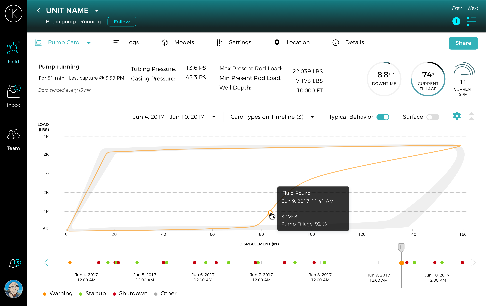
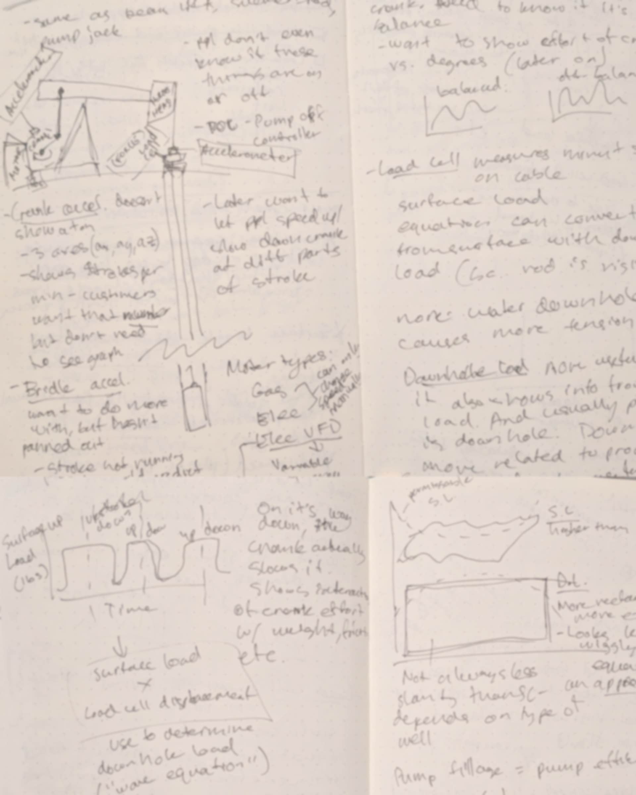

  <browser-chrome></browser-chrome>
  

    

    </img>
  

  

  

  

  

    </img>
  

  

## Existing Design

I picked up this project when I first got to Kelvin, and some design had been done already. The project had been put on hold and the previous designer left the company. Here's what I started with:

## Context

What are pump cards and why do this project?

1.   A pump “card” is an XY plot that represents a single cycle of a beam pump (rod string load × pump displacement).
2.   This is a brand new chart type for Kelvin &mdash; all charts thus far have been timeseries.
3.   Analystss at energy companies use pump cards to diagnose beam pump performance issues. Currently this is done by through antiquated software than can only pull one card per day.

<grid>
  

    </img>
  

  

    <h2>Understanding Pump cards</h2>
    
I didn't know anything about how beam pumps or pump cards work, so the first order of business was to do some background research.
    <h3>Q&A With Data Scientist</h3>
    
I scheduled a session with our resident beam pump expert to understand how the machine works, how the pump card is derived, and how it originated.

    <h3>User Interview Recordings</h3>
    
I listened to a recordings from prior user interviews with our target user as well as other domain experts, on how they use pump cards.

  

</grid>

## User Research
Interviews & user testing with 5 energy company analysts to understand:

*   How do they currently view pump cards?
*   What exactly are they looking for when they view pump cards?
*   How do they view cards from multiple cycles (i.e. how do they interact with time)?
*   What performance issues can occur with a beam pump, and how do they discover, diagnose, and address them?
*   What would they expect to be able to do with our design, and how would it change their workflow?

## Use Cases
From user research, I compiled some key use cases for pump cards:

As an optimizer, I want to:
*   Compare a recent problem card to a normal card from 1 week or 1 month ago.
*   Find out what % of cards from today looked “normal.”
*   See if this problem has happened before.
*   See the first few cycles after startup, or the last few cycles before shutdown.
*   See if my treatment is working (improving pump performance) over the last few hours.
*   See the overall trend from the last 90 days.

## Final Designs

  <browser-chrome></browser-chrome>
  

    

    </img>
  

<grid>
  

    

      

      

      

      

        </img>
      

    

  

  

    

      

      

      

      

        </img>
      

      

    

  

</grid>

