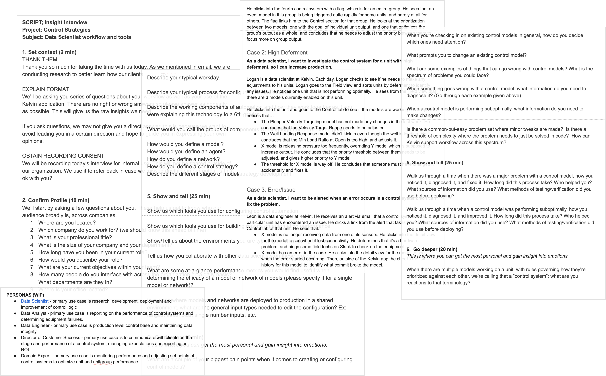
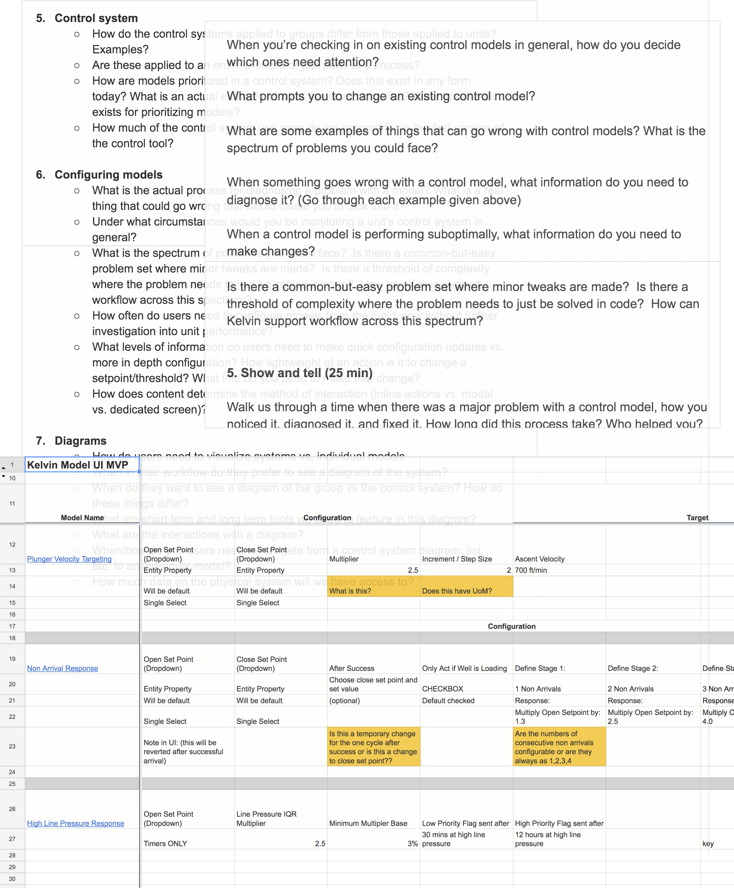
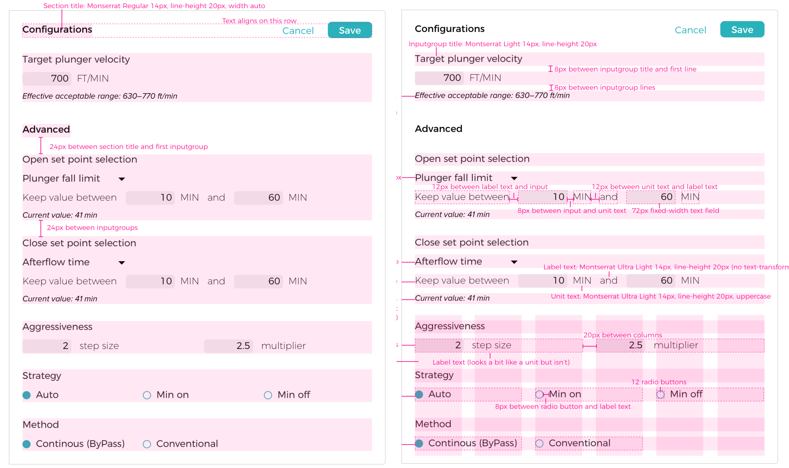
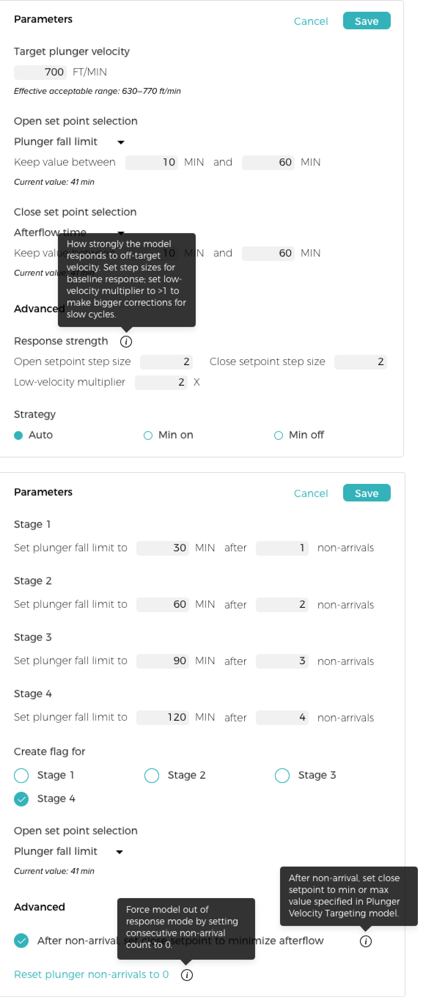

 

## Context
This project is for Kelvin, an industrial automation company. Some key background info:

1.   __Plunger lifts__ are used in natural gas wells to increase production.
2.   Kelvin has __sensors__ on each well that detect gas flow, pressure, vibrations, and other data.
3.   The Kelvin data science team writes __control models__ that optimize production by controlling plunger cycles.

## The Kelvin Application

Before this project began, the Kelvin app was a monitoring and ticketing system for oil and gas. We supported 3 main personas for our clients:

<grid>
  

    

      
    

    <h3>Pumper</h3>
    
Creates daily reports for ~<b>30 wells</b> based on what he sees in the field

    
Performs routine well maintenance, adjusts new wells and recommends <b>equipment changes</b>

    
Cares about identifying issues early

  

  

    

      
    

    <h3>Optimizer</h3>
    
Diagnoses systemic defects for ~<b>300 wells</b> based on analysis of charts & logs

    
Adjusts valve <b>open/close criteria</b> and recommends equipment changes

    
Cares about deviation from expected production

  

  

    

      
    

    <h3>Optimization Lead</h3>
    
Oversees a team of 5-10 optimizers

    
Calculates <b>ROI</b> by comparing production, touchpoints, & equipment costs

    
Cares about the success of the Kelvin pilot

  

</grid>

## Building a Control Platform

We needed to make a pivot in order to scale as a company:

*   Monitoring's nice, but clients want automation
*   Our existing control models are custom made. We spend a ton of internal resources building and tweaking them.
*   We don’t want to be tied to the oil & gas industry
*   Eventually, we want to empower clients to manage their own control models. As a first step, we need to make this process easier for our internal team.

This was an ambitious set of goals. The design team's biggest initial questions we had were:

*   How do we add immediate value, while moving toward our longterm goal?
*   What control models do we have now and what do they actually do?
*   What users and use cases should we focus on?
*   How does our data team manage models today?

## User Research

<grid>
  

  
We interviewed 8 data team members to better understand their workflow.

</grid>

When we started, we didn't know a lot about __how control models work__ on our team. These were our takeaways:

*   Control models are independent blocks of code that __react__ when a well is not running optimally. They make changes in response to certain __thresholds__ in our sensor data.
*   Thresholds and responses can be tuned according to the needs of individual wells through configurable model __parameters__.
*   Models are __semi-automated__: when they’re applied to new wells, there is a period of manually tweaking parameters before they can run on their own.

## The Target User

Initially we thought the target user was a "member of the data science team." When we dug in we realized that we needed to get more specific than that.

*   The data team is comprised of a __wide variety of user types__ with different workflows and areas of expertise.
*   Two data team members are __former optimizers__ at energy companies. They have deep domain knowledge but they don't code.
*   They find model performance issues and recommend changes. They know what needs to change, but __don’t have the tools__ to make those changes.

Based on this, we decided to focus on those data team members, and defined them as a new persona:

  

### Super-Optimizer

Currently a __Kelvin data team member__, but a role that we expect clients to have in the future; replaces several optimizers

Has domain expertise and understands the basics of control models; does not code

Diagnoses and adjusts __control model parameters__; could write simple if-then models from scratch

Cares about control model adaptability

## Use Cases

We identifed several key user needs that we could address as part of this project. Super-optimizers want to:

*   Enable control models on new wells and tune them to work for new environments, equipment, and client needs.
*   Easily see whether a model is performing optimally on a given well, and diagnose issues.
*   Give clients transparency into how successfully models are running and what changes are being made.

## App Architecture

I created some diagrams to show how models could __fit into our existing application__. Though most of this was scoped out for V1, on a high level I wanted to make sure we were setting ourselves up for future iterations.

## Model Content

<grid>
  

    
A big piece of this project was determining <b>what actually needed to be shown and edited</b> for our control models. It was a long process of interviews and information-gathering sessions with the data team to figure out:

    <ul>
      <li>How do users tell if a model is running suboptimally?</li>
      <li>What parameters exist on each model, and how much should we show to users?</li>
      <li>What context do users need to actually change a model parameter?</li>
    </ul>
  

  

    
  

</grid>

## Initial Wireframes

I wireframed some of these views to illustrate our first draft of functionality and model content. We did around of lightweight feedback from the data team with these and got good feedback on content and language.

__Left__: control models on a specific well. __Right__: overview of models for all wells
 

## High Fidelity and More User Testing

I knew that the super-optimizer needed to reference __RTU settings__ to make model parameter changes, so initially I put them at the top of the screen as an expandable gray box. This felt a bit clunky, and when it was collapsed users mistook it for a header.

From feedback on these mockups, I was able to narrow down exactly what information was needed for each model parameter so I could refine this.

## Final Design

Model __parameters__ are shown side by side with __performance metrics__ to help inform the user’s decision.

### Edit mode

Editing a model reveals additional __context__ in the form of calculated and current values.

These are the RTU settings that were at the top of the screen in the last mockup

## Measures of Success

We recently released this internally and to all clients. It’s still early but we’re hoping to:

*   Decrease the time it takes to tune models for new wells
*   Give clients transparency into what model changes are being made
*   Learn clients’ current level of interest in tuning their own models

<grid>
  

    <h2>Followup Improvements</h2>
    
As development started, we realized that we needed to think in a more modular way with our layouts to support new models in the future. I worked with the development team to create components that could be built from a <b>JSON</b> file.

    
As we were rolling this out to production, there was some confusion about what each parameter means. This especially came up in training people who weren't familiar with the models. We added a <b>tooltip</b> component that could be added to the JSON, and I worked with the data team to get the language right.

    
  

  
</grid>

